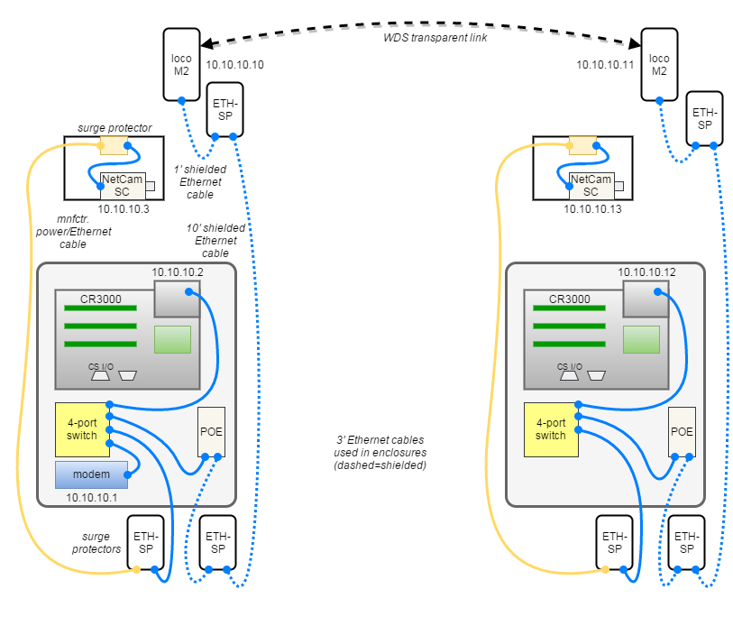

# Network

> This documentation is not specific to the EasyFlux-DL-CR3000 program. It only
> covers the USDA Long-Term Agroeconomic Research (LTAR) site towers at R.J.
> Cook Agronomy Farm.

## Overview

The towers are equipped with internet access for datalogger telemetry and for
the phenocam to submit imagery to the [Phenocam Network](https://phenocam.sr.unh.edu/).
Each pair of towers has a broadband cellular modem and a transparent wireless
bridge which shares the data connection. Static IP addresses and port forward
rules allow a LoggerNet instance to retrieve data on a regular schedule. The
Phenocam is also configured with static IP and operates independently.

## Setup

### Hardware Summary

Parts at each tower:

* Broadband modem (Raven X; Sierra Wireless)
    * *Only at Cook East and Boyd North*
    * Mounting bracket/power cables/antennas/etc
* Directional, outdoor-grade wireless radio (Nanostation LocoM2; Ubiquiti Networks)
    * Surge protectors, to recommendation (ETH-SP; Ubiquiti Networks)
    * Power-over-Ethernet (POE) injector for wifi radio (TP-DCDC-1224; Tycon)
    * Variable-angle vertical pipe bracket
* 12Vdc wide-temperature range Ethernet switch (SW-504; BrainBoxes)
* Datalogger (CR3000; Campbell Scientific)
* Phenocam (Netcam SC 5MP IR; StarDot)
    * Included Ethernet+Power cable
    * Passive Power-over-Ethernet injector (double-check polarity before use)
* Misc. Ethernet cables, shielded (3 & 12 ft lengths recommended)
* Misc. mounting hardware (hose clamps, cable ties, etc)

> There is no line-of-sight between the towers at Boyd Farm and a third radio
> will be added later to relay the signal.

### Modem

* Data plan is "Unlimited" and has no caps or fees based on data usage&#42;
* Broadband modem is assigned a public, static IPv4 address&dagger; 
* DHCP service is turned off since all devices have static IP
* Port forward rules must be created for each datalogger at its configured
  PakBus address (default: 6785)

&#42;*Serviced through a central USDA account*  
&dagger;*Still available on special request but this may change in the future.*

### Wireless radios

* Wireless channel width is decreased to 20 MHz to improve link stability
* Wireless link is a Layer 2 Transparent Bridge (Point-to-Point Link) which uses
  WDS and AirMAX (proprietary) so it's not available to phones/laptops/etc.
* Use adjustable angle bracket to align radios pairs for best signal quality

### CR3000

* Configure a static, private IP address
* Enable relevant security options

### Phenocam

* Configure a static, private IP address
* Setup the camera for direct image upload (see [phenocam](phenocam.md))

## Diagram

> *Update: using all shielded and slightly longer cables is recommended.*

## References

* Sierra Wireless. *ALEOS 4.0.11 Configuration Guide.* Rev 7 June 13. Online:
  <http://web.archive.org/web/20170407210818/https://www.sierrawireless.com/~/media/support_downloads/airlink/docs/user_guides/4.0.11/4112515_aleos%204.0.11%20configuration%20user%20guide_r7.ashx>
* Sierra Wireless. *AirLink Raven X User Guide.* Rev 2.0. Online:
  <http://web.archive.org/web/20170407210010/https://www.sierrawireless.com/~/media/support_downloads/airlink/docs/user_guides/rvn_pp_x_userguides/raven_x_evdo_userguide.ashx>
* Ubiquiti Networks. *Layer 2 Transparent Bridge.*
  Online:   <https://help.ubnt.com/hc/en-us/articles/205142890-airMAX-Configure-a-Point-to-Point-Link-Layer-2-Transparent-Bridge->
* Ubiquiti Networks. *NanoStationM/locoM Quick Start Guide (Multilingual).*
  Online: <https://dl.ubnt.com/guides/NanoStation_M/NanoStation_M_Loco_M_multilingual_QSG.pdf>
* Ubiquiti Networks. *airOS 6 User Guide.* Online: <https://dl.ubnt.com/guides/airOS/airOS_6_UG.pdf>

