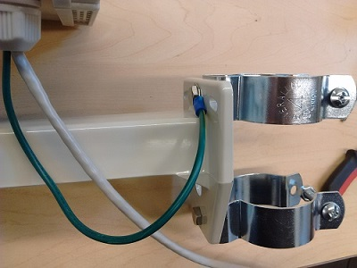

# Phenocam

> This documentation is not specific to the EasyFlux-DL-CR3000 program. It only
> covers the USDA Long-Term Agroeconomic Research (LTAR) site towers at R.J.
> Cook Agronomy Farm.

## Overview

Each tower has a single Phenocam aimed into the primary fetch. The cameras are
all registered with the [Phenocam Network](https://phenocam.sr.unh.edu/webcam/)
and operate independently of the eddy-covariance (EC) and meteorology sensors.
In addition to capturing phenological changes, the cameras help document field
activities. 

### Sites

* R.J. Cook Agronomy Farm (USDA LTAR Network)
    * Cook East: <https://phenocam.sr.unh.edu/webcam/sites/cafcookeastltar01/>
    * Cook West: <https://phenocam.sr.unh.edu/webcam/sites/cafcookwestltar01/>
    * Boyd North: <https://phenocam.sr.unh.edu/webcam/sites/cafboydnorthltar01/>
    * Boyd South: <https://phenocam.sr.unh.edu/webcam/sites/cafboydsouthltar01/>

### Schedule

|
|---|---|
| Daily operation  | Between 4am and 11pm (extent of daylight in summer) |
| Capture interval | Every fifteen minutes (roughly :00, :15, :30, :45) |
| Time zone        | Pacific Standard Time (UTC-0800) |

> The capture interval (15min) aligns with USDA LTAR data reporting guidelines.

### Materials summary

* Standard Phenocam package from Stardot Technologies (<http://stardot.com/>)
    * 5MP StarDot NetCam SC IR with 12V power supply
    * Ethernet+DC power cable
    * outdoor housing and mounting bracket
* Ethernet surge protector (APC ProtectNet PNET1GB)
    * Recommended because it fits inside the camera outdoor housing
* Ethernet surge protector for in the datalogger enclosure (Ubiquiti ETH-SP)
* (2) Threaded rod mount clamping hangers for 1-1/2" ID
    * Closure hardware, and for bolting onto camera housing
    * Select 1-1/2" ID to match diameter of UT10 tower mast
    * Example product: McMaster Item #3006T312
* Misc parts (shielded Ethernet cable, thread-lock compound, 1/4"-20 hardware,
  crimp terminal, wire, hose clamp, etc)

## Camera Setup

Refer to the official [phenocam installation instructions](https://phenocam.sr.unh.edu/pdf/PhenoCam_Install_Instructions.pdf)
for guidance on purchasing, configuration, assembly and installation of the
phenocam. Additional details are provided below.

### Software

1. Change the password (default: admin)
2. Update the camera hostname with site name (ex: `NetCamSC-CookEast`)
3. Reboot
4. Run the [Phenocam Installation Tool (PIT)](https://bluegreen-labs.github.io/phenocam-installation-tool/)
   with arguments in table below
5. Reboot and verify correct settings were applied
6. Open camera settings and assign a static IP address

Refer to the official PIT website (linked above) for complete usage details.

|
|---|---|
| `CAMERA` |*use the registered phenocam site name*
| `TIME_OFFSET` | `-8` |
| `TZ` | `PST` |
| `CRON_START` | `4` |
| `CRON_END` | `22` |
| `CRON_INT` | `15` |
| `FTP_MODE` | `passive` |

### Hardware

Pictures and more detailed descriptions are available in the official 
installation instructions.

1. Mount prepared camera onto housing sled with thread-lock compound.
2. Insert sled into housing and slide camera lens up to the glass window to
   minimize glare. Secure sled with small screw once in position.
3. Feed Ethernet/power cable through housing cable gland and attach to the
   bottom of the housing. Pay attention to power cable connectors when selecting
   which end to feed.
    * Removing the Ethernet jack shroud and shaving down the black rubber molding
      is required to fit through the cable gland nut
    * Alternatively, use electricians putty to seal the cable entry port and
      secure the Ethernet/power cable to the housing arm with cable ties. 
4. Connect power cable to camera.
5. Install surge protector (APC ProtectNet) between camera and Ethernet cable,
   and secure to top of camera with velcro. 
6. Feed surge protector ground wire through cable gland to outside of housing
   and crimp on large ring terminals.
7. Bolt a pair of clamping hangers onto the camera housing mounting holes, 
   securing the surge protector wire as well.

## Installation

Refer to the official installation instructions for additional guidance on
camera positioning.

1. Mount camera at appropriate height to obtain best field of view and maintain
   access for servicing.
2. Secure Ethernet/power cable to the tower with cable ties, leaving slack to
   allow for minor adjustments.
3. Install surge protector (Ubiquiti ETH-SP) in the datalogger enclosure and
   connect to grounding stud.
4. Connect switch to surge protector with shielded cable.
5. Connect phenocam Ethernet cable to surge protector.
6. Connect phenocam power cable to pigtail from 12Vdc power rails.
7. Test the camera by logging in, and use the live feed to fine-tune the camera
   position.

## References

* Koen Hufkens. *Phenocam Installation Tool.* Untagged commit `ac578c4`. Online:
  <http://khufkens.github.io/phenocam-installation-tool/>
* Richardson, A., Klosterman, S., & Hufkens, K. *Phenocam Installation Instructions.*
  Revision Oct 2016. Online: <https://phenocam.sr.unh.edu/pdf/PhenoCam_Install_Instructions.pdf>
* The University of New Hampshire. *Phenocam Frequently Asked Questions.* Online:
  <https://phenocam.sr.unh.edu/webcam/faq/>

