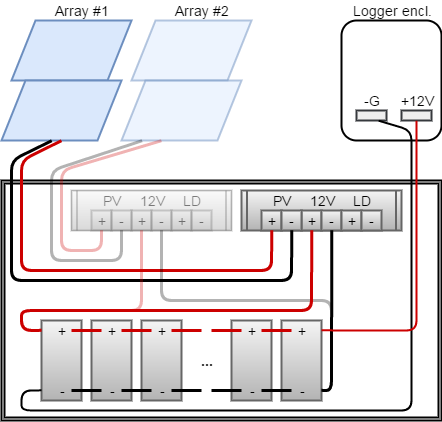
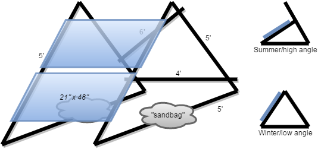

# Power Details

> This documentation is not specific to the EasyFlux-DL-CR3000 program. It only
> covers the USDA Long-Term Agroeconomic Research (LTAR) site towers at R.J.
> Cook Agronomy Farm.

## Overview

The eddy-covariance (EC) towers run on solar-powered 12Vdc battery systems.
Towers deployed at R. J. Cook Agronomy Farm (Cook East/West) use older
equipment from the Regional Approaches to Climate Change (REACCH) project.
Towers deployed at Boyd Farm (Boyd North/South) use newer equipment purchased
for the Long-Term Agroeconomic Research (LTAR) project. 

## Cook Farm Towers (SunSaver)

Parts for one tower are listed below. Each *SunSaver-10-12V* charge controller
can support two solar panels in parallel connection, and the charging outputs
can be paralleled into the battery array. Though not ideal, the controllers are
located in the same enclosure as the batteries because they provide temperature
compensation and the sensor is embedded into the control unit. Fusing is also
located in the battery enclosure. To disconnect equipment in the datalogger
enclosure, use the green removable power plugs.

* (4) solar panels (Campbell Scientific SP70 or SP90)
* (2) charge controller (Morningstar SunSaver-10-12V)
* (5 to 7) deep-cycle 12V flooded batteries
* misc. electrical (e.g. wire, crimp terminals, fuses, screw terminal blocks)
* sturdy, ventilated battery enclosure (see section below)
* (2) solar panel stands (see section below)

### Notes

* Be familiar with user documentation (see *References* below)
* Use appropriate fuses (not pictured)
* Do not exceed equipment ratings
* Disconnect all tower equipment from power before setup or servicing
* Remove the flooded jumper from charge controller 
* Use the low-voltage disconnect (LVD) feature, if available
* Protect cables with outdoor-rated conduit

## Boyd Farm Towers (TriStar TS-45)

Parts for one tower are listed below. The *TriStar TS-45* charge controller
accepts higher solar voltage levels so the two panels are connected in series
to (hopefully) provide sufficient voltage for charging even when cloudy or in
winter when sun angles are much lower.

* (2) solar panels (SolarLand SLP120-12U)
* (1) charge controller (Morningstar TriStar TS-45)
    * (1) Remote Temperature Sensor accessory (Morningstar RTS)
    * (1) local display/keypad accessory (Morningstar TS-M-2)
    * (1) MC4 extension cable, 50ft long (cut in half to make 2x 25ft cables)
* 5 to 7 deep-cycle 12V flooded batteries
* misc. electrical (e.g. wire, crimp terminals, fuses, screw terminal blocks)
* sturdy, ventilated battery enclosure (see section below)
* (1) solar panel stand (see section below)

## Battery Enclosure

All sites are equipped with a steel job chest (Knaack Model 4824 Jobmaster) to
house the batteries and controllers. The chosen size is large enough to fit up
to 9 standard dimension deep-cycle batteries. It also has multiple electrical
pass-thru holes, an overhung lid and outdoor-grade finish. Minimal preparation
is required:

* Attach skids made from 4ft lengths of pressure-treated (ground contact) 2x8 
  dimensional lumber to keep the chest from sinking into the ground. 
* Tape steel bug mesh over unused electrical pass-thru holes to keep pests out.
  Aluminum HVAC tape works well for this application.
* Seal the lock mechanism holes with electrician's putty to keep rodents out.
* Once cables are installed, seal entry points with electrician's putty.
* Apply safety decals and hazard labels as appropriate

## Solar Panel Stands

The solar arrays are mounted on portable stands instead of attached to fixed
concrete posts. This allows them to be moved out of the way of field machinery
or be repositioned for better performance.

### Recommended Materials

* Bolt-Together Framing, 2-1/8" x 1-3/4" Angle, Galvanized Steel
    * lengths of 4', 5' and 6
* Stainless Steel hardware in 1/4"-20 thread size, for securing panels to framing
    * 4x per panel: Hex Head Screw, 3/4" length
    * Attach with screw head inside panel framing
    * Use Standard Washer and Split Lock Washer under the Hex nut
* Stainless Steel hardware in 5/16"-18 thread size, for securing framing together
    * At each joint: Hex Head Screw, 3/4" length
    * Attach screw with Standard Washer on both sides of framing and Split Lock
      Washer under the Hex nut
* Long-Lasting Outdoor Sand Bag
    * High UV resistance to prevent bag rupture
    * Use enough weight to resist strong winter winds
    * Current type in use are "DuraBag&reg;" brand, with the sand liners

## References

* Campbell Scientific. *SP70 Solar Panel Instruction Manual.* Rev 3/09.
  Online: <http://s.campbellsci.com/documents/us/manuals/sp70.pdf>
* Morningstar. *Remote Temperature Sensor Datasheet.* Online:
  <https://www.morningstarcorp.com/products/remote-temperature-sensor/>
* Morningstar. *SunSaver Photovoltaic System Controllers Operator's Manual.*
  101E-R4-2/00. Online: <http://s.campbellsci.com/documents/us/manuals/sunsaver.pdf>
* Morningstar. *TriStar Digital Meters Installation and Operation Manual.*
  Online: <https://www.morningstarcorp.com/products/tristar-digital-meter-2/>
* Morningstar. *TriStar Solar Charging System Controller Insallation, Operation
  and Maintenance Manual.* Online: <https://www.morningstarcorp.com/products/tristar/>
* SOLARLAND. *SLP120-12U Datasheet.* Online:
  <https://www.wholesalesolar.com/9433355/solarland/solar-panels/solarland-slp120-12u-120-watt-module-12v-solar-panel>

