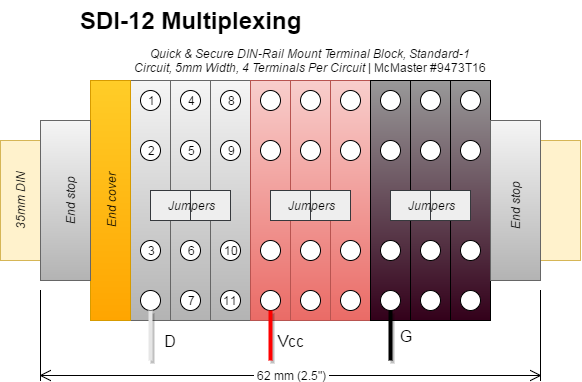

# Sensors

> This documentation is not specific to the EasyFlux-DL-CR3000 program. It only
> covers the USDA Long-Term Agroeconomic Research (LTAR) site towers at R.J.
> Cook Agronomy Farm.

## Overview

### Core Hardware

* CR3000 datalogger ([CR3000](https://www.campbellsci.com/cr3000))
    * `CR3000.Std.31` or newer firmware
* Datalogger network & memory card module ([NL115](https://www.campbellsci.com/nl115) 
  or [NL116](https://www.campbellsci.com/nl116))
    * network connection is required for remote data collection
    * 16GB industrial-grade CompactFlash memory card (min. 2/logger recommended)
* Infrared CO<sub>2</sub>/H<sub>2</sub>O analyzer ([EC150](https://www.campbellsci.com/ec150))
    * Control box ([EC100](https://www.campbellsci.com/ec100)) must be firmware 
      revision 7.01 or later
* Three dimensional ultrasonic anemometer ([CSAT3A](https://www.campbellsci.com/csat3a))

### Deployed Sensors

* Ambient temperature/relative humidity probe ([HMP-155A](https://www.campbellsci.com/hmp155a))
* Net radiometer ([NL-Lite2](https://www.campbellsci.com/nr-lite2))
* Quantum (PAR) sensor ([LI-190SB](https://www.campbellsci.com/li190sb-l))
* Tipping bucket rain gage ([TE525WS](https://www.campbellsci.com/te525ws-l))
* Cup and vane wind set ([034B](https://www.campbellsci.com/034b))
* GPS receiver ([GPS16X-HVS](https://www.campbellsci.com/gps16x-hvs))
* Door switch sensor (magnetic reed switch, NO recommended)
* Averaging thermocouple ([TCAV](https://www.campbellsci.com/tcav-l) x1)
* Water content reflectometer, for heat storage term 
  ([TDR-315L](http://www.acclima.com) x1)
* Soil heat flux plates ([HFP01](https://www.campbellsci.com/hfp01) x1)
* Water content reflectometer, for vertical profiling (TDR-315L)
    * 6 at Cook East/West
    * 2 at Boyd North/South


## Wiring

Complete wiring details are documented in the program file. Refer to one of
these files for a printable summary which is specific to this deployment:

* [Microsoft Word&reg; format (.docx)](wiring.docx) (editable)
* [Portable Document Format (.pdf)](wiring.pdf) (formatted to fit a single size
  Letter page)

SDI-12 sensors are wired into a separate terminal block bus connection:



## Configuration/Setup

### Datalogger (CR3000)

* Update firmware to the latest version (requires `CR3000.Std.31` or later)
* Update program file so `UTC_OFFSET` reflects the correct timezone
* Update program file with correct unique calibration constants
* Upload program file to datalogger CPU drive
* Configure datalogger security code(s)
* Configure a static IP and port forwarding (see [network](network.md))
* Connect sensors correctly (see wiring above)
* Connect a power source (see [power](power.md))
* Provide a CompactFlash memory card

### Sonic/IRGA (EC150, EC100 & CSAT3A)

Sensors use default configuration values. Control box (EC100) firmware must be
revision 7.01 or later. 

### Net radiometer (NR-Lite2)

The unique calibration constant must be updated in the program file.

### Quantum/PAR sensor (LI-190SB)

The unique calibration constant must be updated in the program file.

### Water content reflectometer, for heat storage term (TDR-315L)

The sensors must be programmed with SDI-12 addresses "`1`" and "`2`".

### Heat flux plate(s) (HFP01)

The unique calibration constants must be updated in the program file.

### Water content reflectometer, for vertical profiling (TDR-315L)

The sensors must be programmed with sequential SDI-12 addresses from "`3`" to
"`8`" with higher addresses signifying deeper installation depth. 

## Data Outputs

The program produces several data tables with varying record intervals. Each
table is described on a different sheet in this spreadsheet:

* [Microsoft Excel&reg; format (.xlsx)](doc/data_tables.xlsx)
* *(sorry, PDF format is not provided)*

### LTAR Common Observatory Repository (CORe)

This table is designed to facilitate data reduction and submission of meteorology data to
the USDA LTAR Common Observatory Repository (CORe) database. For more information, refer to 
[Common Observatory Meteorology Data Concept of Operations.pdf](https://www.ars.usda.gov/ARSUserFiles/np211/LTAR%20Meteorology%20Concept%20of%20Operations%20FINAL%20150929.pdf).

* Data table name: `LTAR_Met`
* Record interval: 15 minutes, aligned to midnight

Download a field name lookup table in JSON format from [here](ltar_core_lut.json):

````
{
"amb_tmpr_Avg"       : "AirTemperature",
"rlst_wnd_spd"       : "WindSpeed",
"wnd_dir_compass"    : "WindDirection",
"RH_Avg"             : "RelativeHumidity",
"Precipitation_Tot"  : "Precipitation",
"amb_press_Avg"      : "AirPressure",
"PAR_density_Avg"    : "PAR",
"batt_volt_Avg"      : "BatteryVoltage",
"panel_tmpr_Avg"     : "LoggerTemperature",
"std_wnd_dir"        : null,
"VPD_air"            : null,
"Rn_meas_Avg"        : null
}
````

See the data output spreadsheet (above) for complete table details. Note there
is also a 1-min data table with most of the same measurements.


## References

* Acclima. *User Manual TDR-315/315L/310S.* January, 2017 Rev. 2. Online:
  <http://www.acclima.com/poc7/prodlit/TDR-315%20User%20Manual.pdf>
* Campbell, J., Goodrich, D., Heilman, P., & Sadler, J. *LTAR Common Observatory
  Meteorology Data Concept of Operations.* Version 2.0. September 29, 2015.
  Online: <https://www.ars.usda.gov/ARSUserFiles/np211/LTAR%20Meteorology%20Concept%20of%20Operations%20FINAL%20150929.pdf>
* Campbell Scientific. *CR3000 Micrologger Operator's Manual.* Rev 4/15.
  Online: <http://s.campbellsci.com/documents/us/manuals/cr3000.pdf>
* Campbell Scientific. *CSAT3 Three Dimensional Sonic Anemometer Instruction
  Manual.* Rev 2/15. Online: <http://s.campbellsci.com/documents/us/manuals/csat3.pdf>
* Campbell Scientific. *EasyFlux DL CR3000OP For CR3000 and Open-Path Eddy-Covariance
  System Instruction Manual.* Online: 
  <https://s.campbellsci.com/documents/us/manuals/easyflux-dl.pdf>
* Campbell Scientific. *EC150 CO<sub>2</sub> and H<sub>2</sub>O Open-Path Gas 
  Analyzer and EC100 Electronics with Optional CSAT3A 3D Sonic Anemometer
  Product Manual.* Rev 3/17. Online: <http://s.campbellsci.com/documents/us/manuals/ec150.pdf>
* Campbell Scientific. *Campbell Scientific Enclosures Instruction Manual.* 
  Rev 4/15. Online: <http://s.campbellsci.com/documents/us/manuals/enclosures.pdf>
* Campbell Scientific. *GPS16X-HVS GPS Receiver Instruction Manual.* Rev 9/15.
  Online: <http://s.campbellsci.com/documents/us/manuals/gps16x-hvs.pdf>
* Campbell Scientific. *HMP155A Temperature and Relative Humidity Probe.*
  Rev 6/15. Online: <http://s.campbellsci.com/documents/us/manuals/hmp155a.pdf>
* Campbell Scientific. *HMP45C Temperature and Relative Humidity Probe.*
  Rev 3/09. Online: <https://s.campbellsci.com/documents/us/manuals/hmp45c.pdf>
* Campbell Scientific. *LI190SB Quantum Sensor Instruction Manual.* Rev 2/15.
  Online: <http://s.campbellsci.com/documents/us/manuals/li190sb.pdf>
* Campbell Scientific. *LI190R Quantum Sensor Instruction Manual.* Rev 4/16.
  Online: <https://s.campbellsci.com/documents/us/manuals/li190r.pdf>
* Campbell Scientific. *LoggerNet Version 4.4 Instruction Manual.* Rev 2/16.
  Online: <http://s.campbellsci.com/documents/us/manuals/loggernet.pdf>
* Campbell Scientific. *Met One 034B Windset Instruction Manual.* Rev 1/17.
  Online: <http://s.campbellsci.com/documents/us/manuals/034b.pdf>
* Campbell Scientific. *Model HFP01 Soil Heat Flux Plate Instruction Manual.*
  Rev 10/16. Online: <http://s.campbellsci.com/documents/us/manuals/hfp01.pdf>
* Campbell Scientific. *Model HFP01SC Self-Calibrating Heat Flux Plate Instruction
  Manual.* Rev 10/16. <http://s.campbellsci.com/documents/us/manuals/hfp01sc.pdf>
* Campbell Scientific. *NL115 Instruction Manual.* Rev 6/16. Online:
  <http://s.campbellsci.com/documents/us/manuals/nl115.pdf>
* Campbell Scientific. *NR-LITE2 Net Radiometer Instruction Manual.* 
  Rev 5/16. Online: <http://s.campbellsci.com/documents/us/manuals/nr-lite2.pdf>
* Campbell Scientific. *TE525 Tipping Bucket Rain Gage.* Rev 8/16. Online:
  <https://s.campbellsci.com/documents/us/manuals/te525.pdf>
* Campbell Scientific. *TCAV Averaging Thermocouple Probe Instruction Manual.*
  June 13, 1990. Online: <http://s.campbellsci.com/documents/us/manuals/tcav.pdf>
* Campbell Scientific. *UT10 Universal Tower Instruction Manual.* Rev 6/16.
  Online: <http://s.campbellsci.com/documents/us/manuals/ut10.pdf>
* Decagon Devices. *5TM Water Content and Temperature Sensors Operator's Manual.*
  Version 0. Online: <http://manuals.decagon.com/Manuals/13441_5TM_Web.pdf>
* Decagon Devices. *5TE-5TM Integrators Guide.* Rev 9. Online:
  <http://manuals.decagon.com/Integration%20Guides/5TM%20Integrators%20Guide.pdf>
* Decagon Devices. *SRS Spectral Reflectance Sensor Operator's Manual.* 
  Version July 10, 2017 &mdash; 16:44:30. Online: <http://manuals.decagon.com/Manuals/14597_SRS_Web.pdf>
* Decagon Devices. *SRS NDVI Integrator Guide.* Version R04, Jan 2016. Online: 
  <http://manuals.decagon.com/Integration%20Guides/SRS-N%20Integrators%20Guide.pdf>
* Decagon Devices. *SRS PRI Integrator Guide.* Version R05, Jan 2016. Online: 
  <http://manuals.decagon.com/Integration%20Guides/SRS-P%20Integrators%20Guide.pdf>
* Garmin International. *GPS16x Technical Specifications.* Revision C, October
  2011. Online: <http://static.garmincdn.com/pumac/GPS_16x_tech_specs.pdf>
* Huskeflux. *HFP01 & HFP03 User Manual.* Version manual v1620. Online:
  <http://www.hukseflux.com/sites/default/files/product_manual/HFP01_HFP03_manual_v1620.pdf>
* Kipp & Zonen. *Instruction Sheet NR Lite2 Net Radiometer.* Rev V1004. Online:
  <https://www.kippzonen.com/Download/335/Instruction-Sheet-Net-Radiometers-NR-Lite2>
* LI-COR. *LI-COR Terrestrial Quantum Sensors.* Publication Number 984-08308.
  First printing December 2005. Online: <https://www.licor.com/documents/8yfdtw1rs27w93vemwp6>
* LI-COR. *LI-190 Quantum Sensor Calculation of Multiplier from Campbell Scientific
  Purchased Sensors.* Online: <https://www.licor.com/documents/3vmte7rs3d5zu6swhbum>
* LI-COR. *Principles of Radiation Measurement.* P/N 980-15606 8/15 2nd Edition.
  Online: <https://www.licor.com/documents/liuswfuvtqn7e9loxaut>
* LI-COR. *Using LI-COR's Millivolt Adapters for Interfacing LI-COR Radiation 
  Sensors to Voltage-reading Dataloggers.* Online: <https://www.licor.com/documents/3xc19obvbdjezj7ahhgl>
* Vaisala. *Vaisala HUMICAP&reg; Humidity and Temperature Probe User Guide.*
  Version M210912EN-C. November 2012. Online: 
  <https://www.vaisala.com/sites/default/files/documents/HMP155-User-Guide-in-English-M210912EN.pdf>

